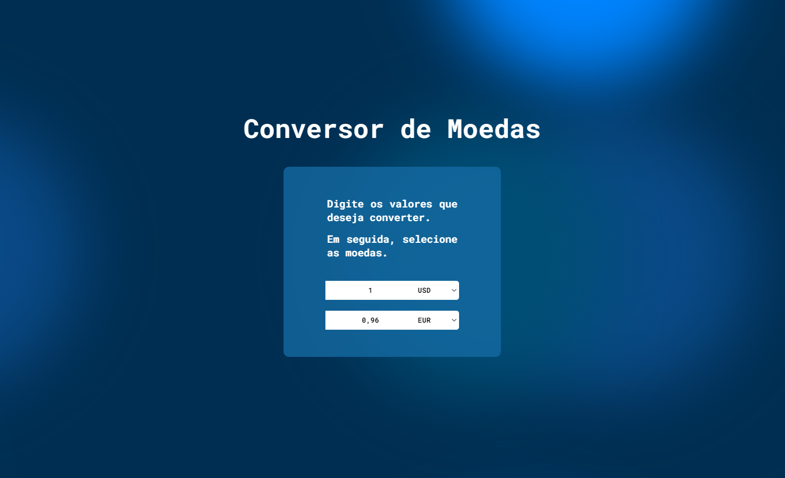

# Currency Converter 🌍💱

Um aplicativo simples de conversão de moedas desenvolvido em **React** com **Vite**. Este projeto utiliza a API da [exchangerate-api](https://www.exchangerate-api.com/) para obter taxas de câmbio em tempo real. 🚀  

---

## 🎯 Funcionalidades  

- Conversão entre diversas moedas.  
- Interface responsiva e intuitiva.  
- Atualização em tempo real das taxas de câmbio utilizando a API.  

---

## 🛠️ Tecnologias e Ferramentas  

- **React** com **Vite**: Para uma performance superior no desenvolvimento front-end.  
- **Axios**: Para realizar as requisições à API da exchangerate-api.  
- **Hooks do React**:  
  - `useState` para gerenciamento de estados.  
  - `useEffect` para lidar com efeitos colaterais (ex.: chamada à API).  
  - `useCallback` para otimização de funções.  

---

## 🚀 Como executar o projeto  

### Pré-requisitos  

- [Node.js](https://nodejs.org/) (versão recomendada: 18+)  
- [npm](https://www.npmjs.com/) ou [yarn](https://yarnpkg.com/)  

### Passo a passo  

1. Clone o repositório:  
   ```bash
   git clone https://github.com/AugustoAlmondes/currency-converter.git
   ```  

2. Acesse o diretório do projeto:  
   ```bash
   cd currency-converter
   ```  

3. Instale as dependências:  
   ```bash
   npm install
   # ou
   yarn install
   ``` 

4. Inicie o servidor de desenvolvimento:  
   ```bash
   npm run dev
   # ou
   yarn dev
   ```  

5. Acesse no navegador:  
   [http://localhost:5173](http://localhost:5173)  

---

## 🗂️ Estrutura do Projeto  

```plaintext
currency-converter/
├── public/                  # Arquivos estáticos
├── src/
│   ├── assets/              # Imagens uteis
│   ├── components/          # Componentes reutilizáveis
│       ├── CurrencyInputs/  # Componente e estilização do input
│       └── Background/      # Componente e estilização do background
│   ├── App.css              # Arquivo de estilo geral
│   ├── App.jsx              # Componente principal
│   └── main.jsx     # Entrada do React
├── .env             # Variáveis de ambiente
├── package.json     # Dependências e scripts
└── vite.config.js   # Configuração do Vite
```  

---

## 🖥️ Demonstração  



**Desenvolvido por [Augusto Almondes](https://github.com/AugustoAlmondes)**  
```  
